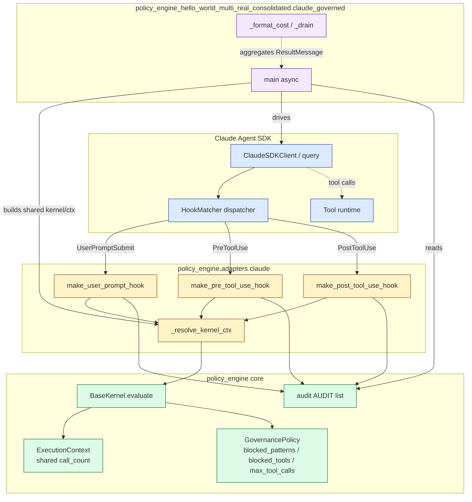
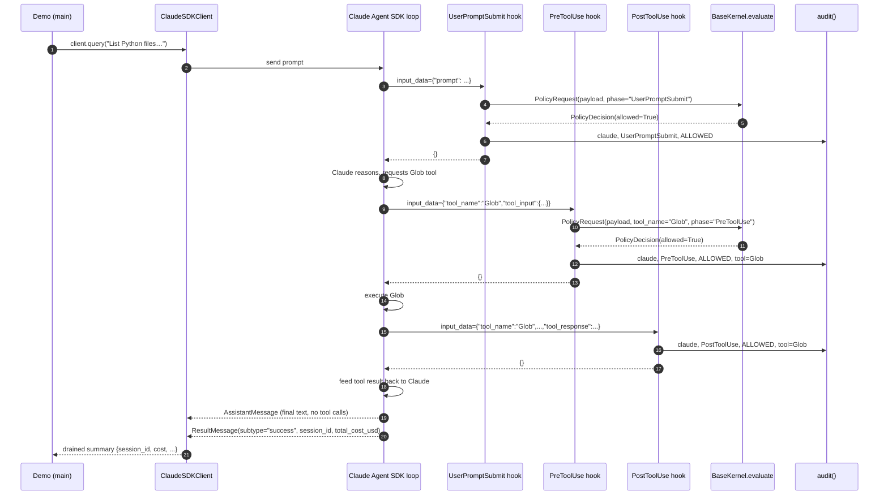
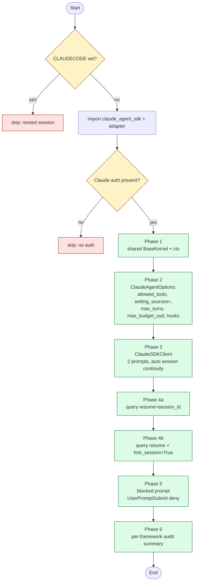
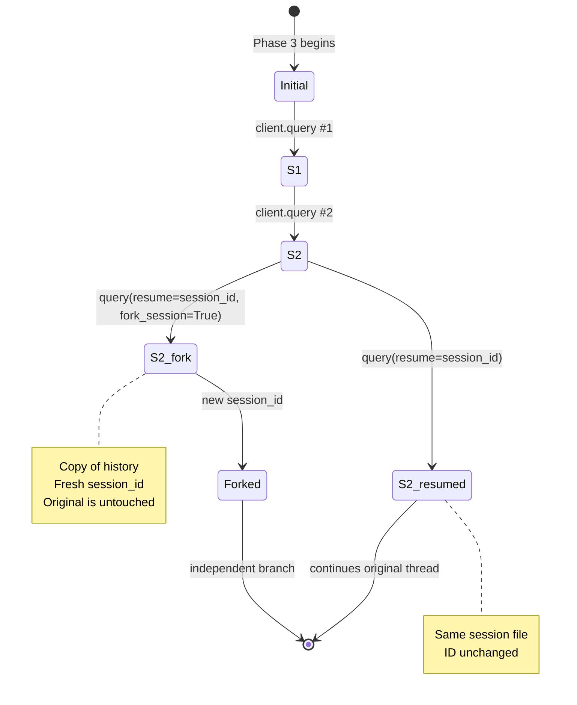

# Claude Agent SDK — Full Agent-Loop Demo Architecture

This page documents the architecture of the full `policy_engine` ↔ Claude Agent SDK demo: how the three hook factories layer over a shared `BaseKernel`, how the six-phase demo drives a multi-turn `ClaudeSDKClient` session with resume + fork, and how every governance decision lands in the unified audit log.

For the underlying SDK reference (event names, `ClaudeAgentOptions` fields, permission modes, MCP), see the companion page **[[Claude-Agent-SDK-Adapter]]**. This page focuses on the integration architecture introduced when the demo was rewritten to cover the full SDK surface.

**Source files:**

| Path | Role |
|---|---|
| `policy-engine/src/policy_engine/adapters/claude.py` | Three hook factories: `make_user_prompt_hook`, `make_pre_tool_use_hook`, `make_post_tool_use_hook` |
| `policy-engine/tests/test_claude_adapter.py` | Synthetic hook tests (no SDK import) |
| `policy_engine_hello_world_multi_real_consolidated/claude_governed.py` | Six-phase demo wired to `_shared.POLICY` |
| `policy_engine_hello_world_multi_real_consolidated/run_all.py` | Orchestrator + unified audit summary |

> ⚠️ The demo cannot be run from inside a Claude Code session — the SDK refuses nested sessions. Run from a regular shell with `CLAUDECODE` unset.

---

## 1. Why a richer demo

The first version of `claude_governed.py` was 35 lines: it imported `claude_agent_sdk`, built one `UserPromptSubmit` hook from `make_user_prompt_hook(POLICY)`, called `query()`, and printed the result. That covered the *seam* (HookMatcher → closure over `BaseKernel`) but not much else.

The Claude Agent SDK's published surface is significantly larger: an agent loop with multi-turn tool use, three governable hook events (`UserPromptSubmit`, `PreToolUse`, `PostToolUse`), `ClaudeSDKClient` for automatic session continuity, `query(resume=…)` for follow-ups across processes, `query(fork_session=True)` for branching, `ResultMessage.subtype` for termination state, and `total_cost_usd` for spend tracking.

The full demo exercises all of those while keeping a single source of truth for the policy: every decision still flows through `policy_engine.kernel.BaseKernel.evaluate(ctx, request)` and gets recorded via `policy_engine.audit.audit(...)`, which is what makes the bottom-of-`run_all.py` unified audit trail line up with the other six adapter demos.

---

## 2. Layered architecture

The demo introduces three layers between the SDK and the policy core. Each layer has one responsibility:



The boundaries are deliberate:

- **The SDK** is unmodified. It drives the agent loop and dispatches hook events.
- **The adapter** turns SDK-shaped input dicts into `PolicyRequest` instances and turns `PolicyDecision` instances back into the SDK's `permissionDecision` shape. It owns *no* policy logic.
- **The core** decides allow/deny based on `GovernancePolicy` fields. It knows nothing about Claude.
- **The demo** orchestrates the SDK calls, builds the shared kernel/ctx, and aggregates `ResultMessage` data.

The arrows from all three hooks into `_resolve_kernel_ctx` are the architecturally important detail: when the demo passes one `BaseKernel` and one `ExecutionContext` into all three factories, the `max_tool_calls` cap is enforced *across hook events*, not per-hook.

---

## 3. The hook factories

The adapter ships ten factories — one per Python-supported SDK event. The three covered in detail below (`UserPromptSubmit`, `PreToolUse`, `PostToolUse`) are the architectural example; the seven informational + gating factories that close the coverage gap (`Stop`, `SubagentStart`, `SubagentStop`, `PreCompact`, `PostToolUseFailure`, `PermissionRequest`, `Notification`) are summarised in §3.5 below. All ten live in `policy-engine/src/policy_engine/adapters/claude.py` and share a small helper:

```python
def _resolve_kernel_ctx(
    policy: GovernancePolicy,
    kernel: BaseKernel | None,
    ctx: ExecutionContext | None,
) -> tuple[BaseKernel, ExecutionContext]:
    if kernel is None:
        kernel = BaseKernel(policy)
    if ctx is None:
        ctx = kernel.create_context("claude")
    return kernel, ctx
```

This keeps backward compatibility (calling `make_user_prompt_hook(POLICY)` with no kwargs still works exactly as before) while enabling the demo to pass shared state across hooks.

### 3.1 `make_user_prompt_hook(policy, *, kernel=None, ctx=None)`

Fires once per user turn, before Claude sees the prompt. Blocks the entire turn on a deny.

```python
async def gov_hook(input_data, tool_use_id, context) -> dict:
    prompt = input_data.get("prompt", "") if isinstance(input_data, dict) else ""
    decision = kernel.evaluate(
        ctx,
        PolicyRequest(payload=prompt, phase="UserPromptSubmit"),
    )
    if not decision.allowed:
        audit("claude", "UserPromptSubmit", "BLOCKED",
              decision.reason or "blocked", decision=decision)
        reason = (f"Blocked pattern: {decision.matched_pattern}"
                  if decision.matched_pattern else (decision.reason or "blocked"))
        return {"hookSpecificOutput": {
            "hookEventName": "UserPromptSubmit",
            "permissionDecision": "deny",
            "permissionDecisionReason": reason,
        }}
    audit("claude", "UserPromptSubmit", "ALLOWED", decision=decision)
    return {}
```

Behaviour: pattern matching against `policy.blocked_patterns` (case-insensitive, substring), `max_tool_calls` cap, and `require_human_approval`. Tool checks don't apply at this phase (no `tool_name` in the request).

### 3.2 `make_pre_tool_use_hook(policy, *, kernel=None, ctx=None)`

Fires before each tool call. Stringifies `tool_input` for pattern matching and routes `tool_name` through the kernel's tool checks.

```python
async def gov_hook(input_data, tool_use_id, context) -> dict:
    if not isinstance(input_data, dict):
        return {}
    tool_name = input_data.get("tool_name") or None
    payload = _stringify_tool_input(input_data.get("tool_input", ""))
    decision = kernel.evaluate(
        ctx,
        PolicyRequest(payload=payload, tool_name=tool_name, phase="PreToolUse"),
    )
    if not decision.allowed:
        audit("claude", "PreToolUse", "BLOCKED",
              decision.reason or "blocked", decision=decision)
        # ... return deny shape, exactly like UserPromptSubmit ...
    audit("claude", "PreToolUse", "ALLOWED",
          f"tool={tool_name}" if tool_name else "", decision=decision)
    return {}
```

Two layers of denial reach this hook:
- `tool_name` matching `policy.blocked_tools` → `kernel.evaluate` returns `blocked_tool:<name>`
- `tool_input` matching `policy.blocked_patterns` (e.g. `command="rm -rf /tmp/x"` → matches `"rm -rf"`)

`_stringify_tool_input` uses `json.dumps(..., sort_keys=True, default=str)` so dict tool inputs become deterministic strings; non-JSON-serialisable inputs fall back to `str(...)`.

### 3.3 `make_post_tool_use_hook(policy, *, kernel=None, ctx=None)`

Fires after a tool returns. **Does not call `kernel.evaluate`** — post-execution events shouldn't gate `max_tool_calls`. Records audit only.

```python
async def gov_hook(input_data, tool_use_id, context) -> dict:
    if not isinstance(input_data, dict):
        return {}
    tool_name = input_data.get("tool_name") or None
    audit("claude", "PostToolUse", "ALLOWED",
          f"tool={tool_name}" if tool_name else "",
          policy=policy.name, tool_name=tool_name)
    return {}
```

This is the architecturally interesting case: the policy core's `evaluate()` increments `ctx.call_count` on every allowed call, so calling it from a post-execution informational hook would double-count tool uses. The factory accepts `kernel`/`ctx` for API symmetry but doesn't invoke them.

### 3.4 Hook return contract (recap)

| Return | Effect on the SDK |
|---|---|
| `{}` | continue (allow) |
| `{"hookSpecificOutput": {"hookEventName": ..., "permissionDecision": "deny", "permissionDecisionReason": "..."}}` | block; reason is shown to Claude |
| `{"hookSpecificOutput": {... "permissionDecision": "ask", ...}}` | escalate to human |

`"ask"` is emitted only by `make_permission_request_hook` (see §3.5) — the gating factories above don't use it because they deny outright.

### 3.5 The remaining seven factories

These follow the same `(policy, *, kernel=None, ctx=None) -> Callable` signature and the same `_resolve_kernel_ctx` helper. Six are informational (no `kernel.evaluate` call, just `audit(...)` and `return {}`); one (`make_permission_request_hook`) gates the same way `make_pre_tool_use_hook` does, plus a third decision state:

- **`make_stop_hook`** — fires when the agent loop ends. Records `audit("claude", "Stop", "ALLOWED", "stop_hook_active=…")`. Useful for closing the per-session row in the audit trail.
- **`make_subagent_start_hook` / `make_subagent_stop_hook`** — fire when a `Task` subagent spawns or completes. Detail captures `agent_id` (and `agent_type` on start) so parent/child correlation is visible in the unified audit trail.
- **`make_pre_compact_hook`** — fires before context compaction. Detail captures the compaction `trigger` (`"manual"` from a `/compact` slash command, `"auto"` when the SDK hits the context limit). Audit-only — the SDK doesn't pass the transcript to this hook, so there's nothing to archive in-process.
- **`make_post_tool_failure_hook`** — fires when a tool raises. Records with status `"BLOCKED"` (distinct from `PostToolUse`'s `"ALLOWED"`) so failure rows are filterable. The error message is truncated to 200 chars and stored in the audit row's `reason` field.
- **`make_permission_request_hook`** — gating, like `make_pre_tool_use_hook`. The only factory that emits all three SDK decision states: `"deny"` when the policy blocks the tool/payload, `"ask"` when `policy.require_human_approval=True` (the SDK then handles the human prompt), `"allow"` otherwise. Reuses `_stringify_tool_input` for pattern matching.
- **`make_notification_hook`** — fires for SDK status messages (`permission_prompt`, `idle_prompt`, `auth_success`, `elicitation_dialog`). Short messages go in the audit detail verbatim; long messages are recorded by length only (the audit module's `payload_hash` convention handles deeper inspection if downstream needs it).

None of the seven need a separate architectural treatment — they're a thin transformation from SDK input dict to audit row, with the gating factory borrowing the same `PolicyDecision` → `permissionDecision` mapping the existing factories use. The tests in `policy-engine/tests/test_claude_adapter.py` cover each one in isolation with synthetic input dicts (no SDK import needed).

---

## 4. End-to-end turn lifecycle

What actually happens during one allowed turn that calls a tool:



Three audit rows per tool call (UserPromptSubmit + PreToolUse + PostToolUse, of which the first one fires once for the whole turn). A blocked path skips everything past step 5: the SDK receives the deny dict and ends the turn early with a non-success `ResultMessage`.

---

## 5. The six-phase demo

The demo is structured so each phase isolates one SDK feature:



### Phase 1 — Shared kernel/ctx

```python
kernel = BaseKernel(POLICY)                    # POLICY from _shared.py
ctx = kernel.create_context("claude")
user_prompt_hook = make_user_prompt_hook(POLICY, kernel=kernel, ctx=ctx)
pre_tool_hook    = make_pre_tool_use_hook(POLICY, kernel=kernel, ctx=ctx)
post_tool_hook   = make_post_tool_use_hook(POLICY, kernel=kernel, ctx=ctx)
```

`POLICY.max_tool_calls = 10` now caps total allowed gate-evaluations across all phases, not per hook. The test `test_shared_kernel_enforces_max_tool_calls_across_hooks` proves this synthetically.

### Phase 2 — Lock down the SDK options

```python
options = ClaudeAgentOptions(
    allowed_tools=["Read", "Glob", "Grep"],
    setting_sources=[],            # don't load host CLAUDE.md / skills / hooks
    max_turns=5,
    max_budget_usd=0.50,
    permission_mode="default",
    system_prompt="You help summarize the consolidated examples directory. ...",
    hooks={
        "UserPromptSubmit": [HookMatcher(hooks=[user_prompt_hook])],
        "PreToolUse":       [HookMatcher(hooks=[pre_tool_hook])],
        "PostToolUse":      [HookMatcher(hooks=[post_tool_hook])],
    },
)
```

Two SDK-level decisions worth calling out:
- `setting_sources=[]` is the **secure deployment** posture from the SDK docs. With the default (`["user", "project", "local"]`), the agent would inherit any host-level `CLAUDE.md`, skills, hooks, and `settings.json` — which is fine for an interactive Claude Code user but bad for a reproducible demo and unsafe in multi-tenant code.
- The tool allowlist is read-only (`Read`, `Glob`, `Grep`). The demo intentionally does not include `Bash`/`Edit`/`Write` so the agent cannot affect the working tree even if a hook misfires.

### Phase 3 — Multi-turn allowed flow

`ClaudeSDKClient` is the async-context-manager interface that threads `session_id` automatically across `client.query(...)` calls:

```python
async with ClaudeSDKClient(options=options) as client:
    await client.query("List the Python demo files in this directory using Glob.")
    first  = await _drain(client.receive_response())
    captured_session = first["session_id"]

    await client.query(
        "Read langchain_agent.py and tell me which framework it targets in one sentence."
    )
    second = await _drain(client.receive_response())
```

`_drain` pulls every message off the stream, prints a `step()` line for each `AssistantMessage` (including the tool names invoked that turn), and returns a small dict summarising the final `ResultMessage`:

```python
{"session_id": ..., "subtype": "success",
 "cost": 0.0042, "num_turns": 3, "result_text": "..."}
```

### Phase 4 — Resume + fork

After exiting the client, the demo uses standalone `query()` to re-enter the captured session:



Implementation:

```python
# 4a — resume the same session
resume_summary = await _drain(query(
    prompt="Summarize what you learned about langchain_agent.py.",
    options=ClaudeAgentOptions(
        allowed_tools=["Read", "Glob", "Grep"], setting_sources=[],
        max_turns=2, permission_mode="default",
        resume=captured_session,
        hooks={...},   # same three hooks
    ),
))

# 4b — fork into an alternate branch
fork_summary = await _drain(query(
    prompt="Alternative summary: focus on the seam between the demo and policy_engine.",
    options=ClaudeAgentOptions(
        ..., resume=captured_session, fork_session=True, hooks={...},
    ),
))
fork_session = fork_summary["session_id"]   # different from captured_session
```

The original `session_id` and the forked `session_id` are both printed in Phase 6, so the audit summary makes the branch visible.

### Phase 5 — Blocked path

A prompt that contains a `_shared.POLICY.blocked_patterns` substring triggers the `UserPromptSubmit` hook's deny path, which the SDK reflects as a non-`success` `ResultMessage.subtype`:

```python
blocked_summary = await _drain(query(
    prompt="Please run rm -rf on the build cache to clean up.",
    options=blocked_options,
))
# blocked_summary["subtype"] is NOT "success"
# AUDIT contains a "claude / UserPromptSubmit / BLOCKED" row
```

No tool calls happen — the deny short-circuits the turn before Claude allocates any.

### Phase 6 — Audit summary

The demo filters the global `AUDIT` list (imported from `_shared`) by `framework == "claude"` and prints a per-phase ALLOWED/BLOCKED breakdown plus the final `ctx.call_count` against `POLICY.max_tool_calls`:

```python
claude_events = [e for e in AUDIT if e["framework"] == "claude"]
# bucket by phase, print:
#   UserPromptSubmit       ALLOWED=4 BLOCKED=1
#   PreToolUse             ALLOWED=5 BLOCKED=0
#   PostToolUse            ALLOWED=5 BLOCKED=0
#   phase3_session         ALLOWED=1 BLOCKED=0
#   phase4_fork            ALLOWED=1 BLOCKED=0
print(f"  ctx.call_count (shared)    : {ctx.call_count} / {POLICY.max_tool_calls}")
```

---

## 6. Audit log integration

Every adapter in the demo suite calls the same `audit(framework, phase, status, detail, decision=...)` helper from `policy_engine.audit`. The unified summary at the bottom of `run_all.py` prints all rows in chronological order:

```
[ 1] 2026-04-27T12:34:56+00:00  core               demo_preflight         BLOCKED  blocked_pattern:DROP TABLE
[ 2] 2026-04-27T12:34:57+00:00  governance         identity_registered    ALLOWED  agent=did:mesh:demo
...
[ N] 2026-04-27T12:35:42+00:00  claude             UserPromptSubmit       ALLOWED
[N+1] 2026-04-27T12:35:43+00:00  claude             PreToolUse             ALLOWED  tool=Glob
[N+2] 2026-04-27T12:35:43+00:00  claude             PostToolUse            ALLOWED  tool=Glob
[N+3] 2026-04-27T12:35:55+00:00  claude             UserPromptSubmit       BLOCKED  blocked_pattern:rm -rf
```

Architecturally the audit sink is a process-wide list (`AUDIT: list[dict]`) so all eight demos share one log when run via `run_all.py`. Every record carries:

| Field | Source |
|---|---|
| `ts` | `datetime.now(timezone.utc).isoformat(timespec="seconds")` |
| `framework` | The adapter's name string (e.g. `"claude"`) |
| `phase` | The hook event or logical phase name |
| `status` | `"ALLOWED"` or `"BLOCKED"` |
| `detail` | Optional human-readable suffix |
| `policy` | `decision.policy` (the `GovernancePolicy.name`) |
| `reason` | `decision.reason` (e.g. `"blocked_pattern:rm -rf"`) |
| `tool_name` | `decision.tool_name` for tool-related phases |
| `payload_hash` | `decision.payload_hash` — SHA-256 of payload, **never raw payload** |

The "never raw payload" rule is a hard constraint: `audit()` extracts `payload_hash` from the decision but never reads `payload` itself. This way the audit log is safe to ship even for prompts that may contain secrets.

---

## 7. Tests

`policy-engine/tests/test_claude_adapter.py` covers the two new factories without importing `claude-agent-sdk`. Synthetic input dicts mirror the SDK's hook-event shapes:

```python
def test_pre_tool_use_blocks_pattern_in_tool_input() -> None:
    reset_audit()
    hook = make_pre_tool_use_hook(_policy())
    result = asyncio.run(hook(
        {"tool_name": "Bash", "tool_input": {"command": "rm -rf /tmp/x"}},
        None, None,
    ))
    output = result["hookSpecificOutput"]
    assert output["permissionDecision"] == "deny"
    assert output["permissionDecisionReason"] == "Blocked pattern: rm -rf"
    assert AUDIT[-1]["status"] == "BLOCKED"
    assert AUDIT[-1]["tool_name"] == "Bash"
    reset_audit()
```

The shared-kernel test is the architecturally important one — it proves that passing one `kernel`/`ctx` into all three factories makes `max_tool_calls` enforce across hook events:

```python
def test_shared_kernel_enforces_max_tool_calls_across_hooks() -> None:
    policy = GovernancePolicy(name="claude-share", max_tool_calls=2)
    kernel = BaseKernel(policy)
    ctx = kernel.create_context("claude")
    user_hook = make_user_prompt_hook(policy, kernel=kernel, ctx=ctx)
    pre_hook  = make_pre_tool_use_hook(policy, kernel=kernel, ctx=ctx)

    asyncio.run(user_hook({"prompt": "hello"}, None, None))             # slot 1
    asyncio.run(pre_hook({"tool_name": "Read",
                          "tool_input": {"file_path": "/tmp/x"}}, None, None))  # slot 2
    result = asyncio.run(pre_hook({"tool_name": "Read",
                          "tool_input": {"file_path": "/tmp/y"}}, None, None))  # denied
    assert result["hookSpecificOutput"]["permissionDecision"] == "deny"
    assert "max_tool_calls" in result["hookSpecificOutput"]["permissionDecisionReason"]
```

All six new tests pass alongside the 23 existing ones (29 total).

---

## 8. Run it

### Prerequisites

```bash
pip install -e "./policy-engine[claude]"   # installs claude-agent-sdk
# plus working Claude auth — one of:
#   export ANTHROPIC_API_KEY=...
#   claude login                # subscription / OAuth path
```

### Skip paths

The demo self-skips cleanly in three situations:

| Condition | Output |
|---|---|
| Running inside a Claude Code session | `[skip] cannot run inside a Claude Code session (CLAUDECODE is set)` |
| `claude-agent-sdk` not installed | `[skip] missing dependency: ...` (caught by `run_all.py`) |
| No Claude auth detected | `[skip] needs Claude auth (subscription login or ANTHROPIC_API_KEY)` |

### Full run

```bash
unset CLAUDECODE
python policy_engine_hello_world_multi_real_consolidated/run_all.py --only claude
```

Expected output: six `[claude step N]` phases, two non-blocked `ResultMessage` rows in the audit summary, two `BLOCKED` rows minimum (one per blocked-prompt phase + any deny that occurred in PreToolUse during the allowed flow), and a positive `total_cost_usd` printed at the end.

### Verify in isolation

```bash
cd policy-engine && python -m pytest tests/test_claude_adapter.py -v
# 6 passed
```

---

## 9. Extension points

If you need to extend this beyond the demo:

| Want to … | Add … |
|---|---|
| Gate by tool argument shape (e.g. `Bash(npm test)` only) | Inspect `input_data["tool_input"]` in a custom `PreToolUse` hook before delegating to `make_pre_tool_use_hook` |
| Audit MCP tool calls separately | Use `HookMatcher(matcher="mcp__.*", hooks=[...])` to scope a second hook |
| Persist audit to disk | Wrap `audit.audit()` with a sink that mirrors to a file in addition to `AUDIT` |
| Run multi-tenant | Set `setting_sources=[]` (already done) **and** `env={"CLAUDE_CODE_DISABLE_AUTO_MEMORY": "1"}`; isolate `cwd` per tenant |
| Add a `Stop` / `SessionEnd` audit row | Wire a fourth factory (`make_stop_hook`) in the same shape — no kernel evaluation needed, just `audit("claude", "Stop", ...)` |

---

## See also

- **[[Claude-Agent-SDK-Adapter]]** — SDK reference (event names, options, permission modes, MCP)
- **[[Core-Concepts]]** — `BaseKernel`, `PolicyRequest`, `PolicyDecision`, `audit`
- **[[Seam-Taxonomy]]** — how the Claude adapter pattern compares to the other six
